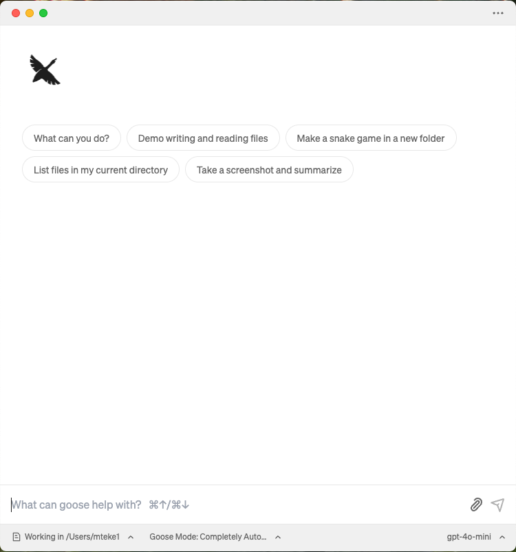
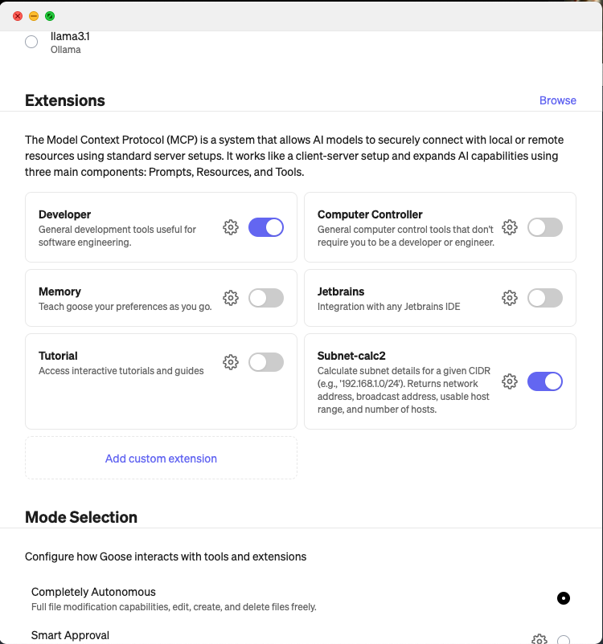
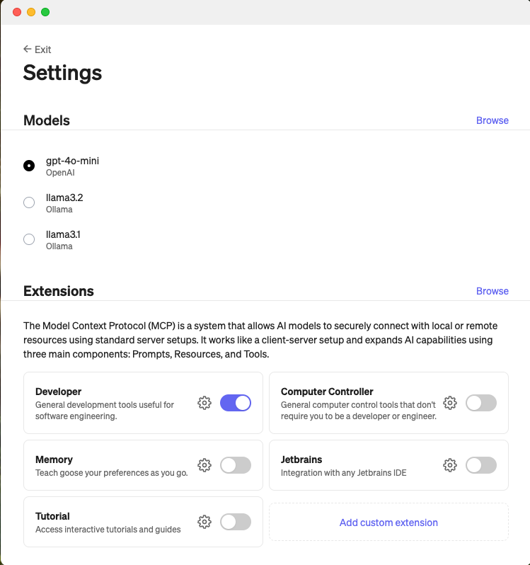

# mcp-subnet-calculator

This project provides a simple MCP (Micro Control Protocol) server for calculating subnet details based on a given CIDR (Classless Inter-Domain Routing) notation. It uses the FastMCP library to expose the subnet calculation functionality as a tool.

## Features
1. Calculate subnet details for a given CIDR.
2. Provides:
- Network address
- Broadcast address
- Netmask
- Wildcard mask
- Usable host range
- Number of usable hosts
3. Runs as an MCP server with SSE (Server-Sent Events) transport.

## Requirements
- Python 3.7+
- fastmcp library

## Installation
- Clone the repository or copy the script.
- Install the required dependencies:
```sh
pip install fastmcp
```

## Usage
THis MCP runs with SSE transport mode.

Run the MCP server:
```sh
python main.py
```

## How to add this Server to your MCP Client

1. Goose MCP Client
- Click Menu and select Advanced settings:



- Go extentions section



- Select "Add custom extentions"




2. Claude Desktop MCP Client
This part will be added later.