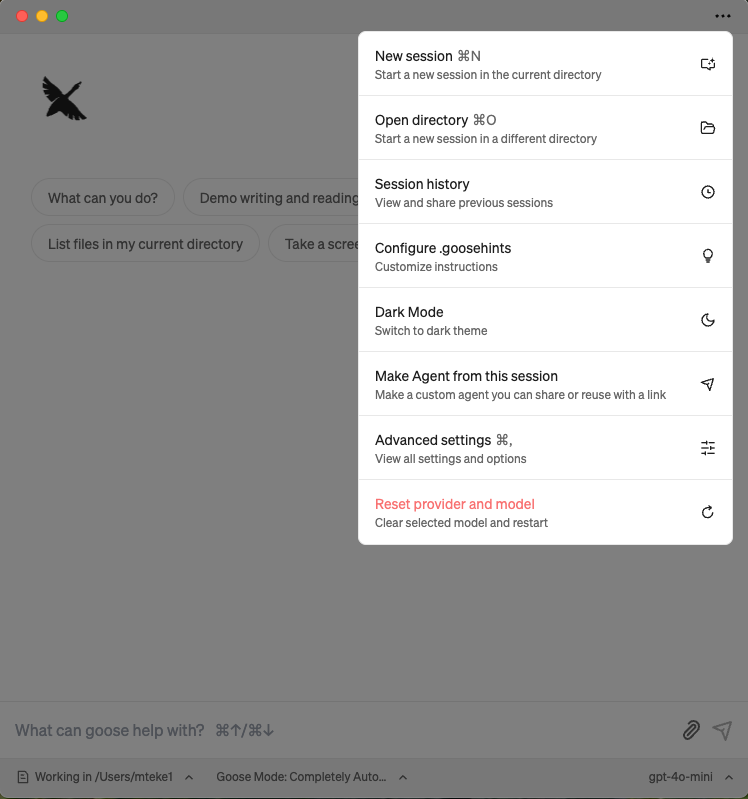
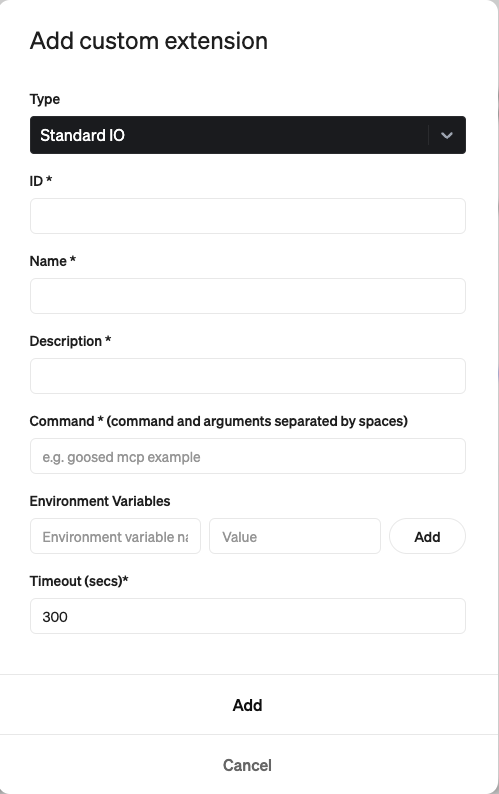
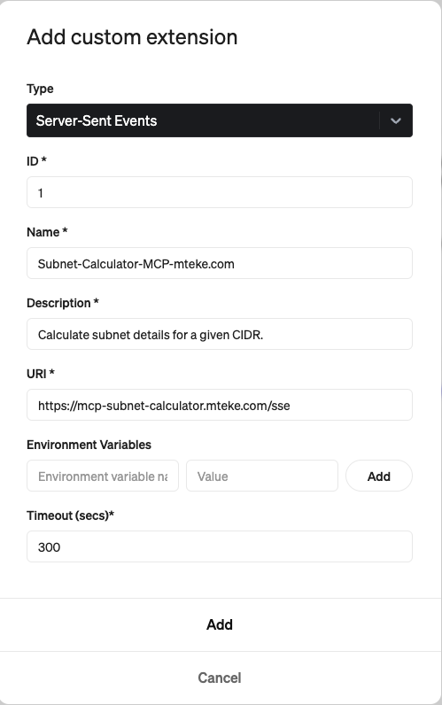
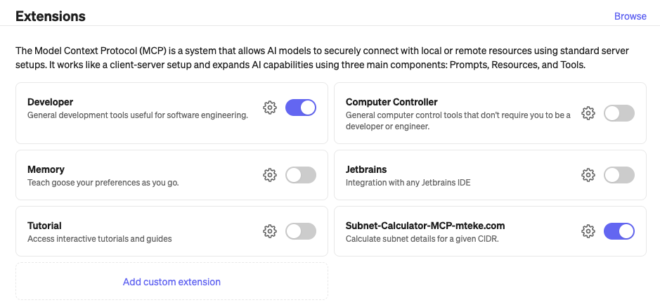

# mcp-subnet-calculator

This project provides a simple MCP (Micro Control Protocol) server for calculating subnet details based on a given CIDR (Classless Inter-Domain Routing) notation. It uses the FastMCP library to expose the subnet calculation functionality as a tool.

## Features
1. Calculate subnet details for a given CIDR.
2. Provides:
- Network address
- Broadcast address
- Netmask
- Wildcard mask
- Usable host range
- Number of usable hosts
3. Runs as an MCP server with SSE (Server-Sent Events) transport.

## Requirements
- Python 3.7+
- fastmcp library

## Installation
- Clone the repository or copy the script.
- Install the required dependencies:
```sh
pip install fastmcp mcp[cli]
```

## Usage
THis MCP runs with SSE transport mode.

Run the MCP server:
```sh
python main.py
```

## How to add this Server to your MCP Client

### Goose MCP Client
- Click Menu ("..." icon) and select Advanced settings:




- Go extentions section


- Select "Add custom extentions"



- Select Server-Sent Events as Type
- Select a random ID
- Select Name for the MCP Server
- Sleect Description
- Enter URI : https://mcp-subnet-calculator.mteke.com/sse
- Click Add button



Now the MCP Server(extention is added and enabled)


Now the MCP server is activated:


You can watch the video to demonstrate how to enable mcp server on Goose Client App:
[](https://www.youtube.com/shorts/SZ-UcUz4_Bk)

### Claude Desktop MCP Client
This part will be added later.